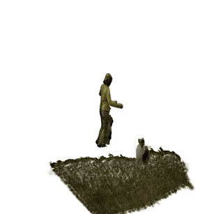
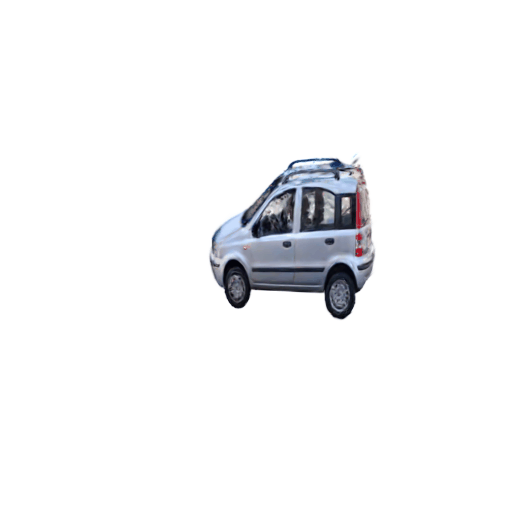

# GenMOJO: Robust Multi-Object 4D Generation for In-the-wild Video


> [**GenMOJO: Robust Multi-Object 4D Generation for In-the-wild Videos**](https://genmojo.github.io/)            
> Carnegie Mellon University   
> Wen-Hsuan Chu*, Lei Ke*, Jianmeng Liu*, Mingxiao Huo, Pavel Tokmakov, Katerina Fragkiadaki

### [**[Project Page]**](https://genmojo.github.io/) **|** [**[Paper (Updated)]**](https://arxiv.org/abs/2506.12716)

<table>
  <tr>
    <td style="text-align: center; vertical-align: middle;"></td>
    <td style="text-align: center; vertical-align: middle;"></td>
  </tr>
</table>

News and Todos
-----------------
- (08.18.2025) v1 of the code has been released!
- (TODO) Release MOSE-PTS.

Installation
-----------------
We recommend using conda to create separate Python environments.
```bash
# Create new conda env
conda create -n genmojo python=3.8.18
conda activate genmojo

# Install PyTorch
# Any version between 2.2 to 2.4 should work, no guarantees for higher versions
conda install pytorch==2.2.0 torchvision==0.17.0 torchaudio==2.2.0 pytorch-cuda=11.8 -c pytorch -c nvidia

# Install torch-geometric
pip install torch_cluster -f https://data.pyg.org/whl/torch-2.2.0+cu118.html
pip install torch_geometric

# Install other dependencies
pip install -r requirements.txt

# simple-knn and nvdiffrast
pip install ./simple-knn
pip install git+https://github.com/NVlabs/nvdiffrast/

# GMFlow and Gaussian Splatting

# IMPORTANT: Download weights manually to gmflow/pretrained/gmflow_kitti-285701a8.pth from https://drive.google.com/file/d/1d5C5cgHIxWGsFR1vYs5XrQbbUiZl9TX2/view

# You can check the GMFlow readme for more detailed instructions

# Install modified gaussian splatting (+ depth, alpha, extra "feature" rendering)
pip install ./diff-gaussian-rasterization-extra
```

Demo Run
-----------------
We provide two versions of our model: one without background optimization, and one with background optimization using estimated camera poses, utilizing fully automatic scripts that executes each stage sequentially. We also included some parsed videos that can be used for some quick demos. If you want to run your own videos, please take a look at the Data Format section to see what is required.

### Demo 1
For demo 1, we will demonstrate the results without background optimization.
<table>
  <tr>
    <td style="text-align: center; vertical-align: middle;"></td>
    <td style="text-align: center; vertical-align: middle;"></td>
    <td style="text-align: center; vertical-align: middle;"></td>
  </tr>
</table>
This example contains two people crossing the sidewalk, with a truck moving in the back. To run the fully automatic script on the video sequence, use:

```bash
# This version optimizes the foreground objects.
python run.py --lite --data_dir ./data/JPEGImages/crossing --mask_dir ./data/Annotations/crossing --save_name crossing
```

* `--lite`: (Optional), runs the script with less optimization steps. Trade-off between speed and performance.
* `--disable_guidance`: (Optional), runs the script without SDS guidance. You probably only want to specify this for ablations.
* `--data_dir`: Directory where the RGB frames are saved.
* `--mask_dir`: Directory where the maks annotations are saved.
* `--save_name`: Identifier name for the saved files.

You can also run ```python run.py --help``` to see other optional arguments alongside with their descriptions.

### Demo 2
For demo 2, we will demonstrate the results with background optimization.
<table>
  <tr>
    <td style="text-align: center; vertical-align: middle;"></td>
    <td style="text-align: center; vertical-align: middle;"></td>
    <td style="text-align: center; vertical-align: middle;"></td>
  </tr>
</table>
This example contains a car driving to the left, while the camera similar looks to the left. To run fully automatic script on the video sequence, simply run:

```bash
# This version optimizes the background using the inpainted background and MegaSAM outputs.
# Note that the quality is *extremely* dependent on MegaSAM's depth estimation, which may not be temporally consistent.
python run_bg.py --lite --data_dir ./data/car-shadow/JPEGImages --mask_dir ./data/car-shadow/Annotations --cam_path ./data/car-shadow/MegaSAM_Outputs/car-shadow_sgd_cvd_hr.npz --save_name car-shadow
```

* `--lite`: (Optional), runs the script with less optimization steps. Trade-off between speed and performance.
* `--disable_guidance`: (Optional), runs the script without SDS guidance. You probably only want to specify this for ablations.
* `--data_dir`: Directory where the RGB frames are saved.
* `--mask_dir`: Directory where the maks annotations are saved.
* `--save_name`: Identifier name for the saved files.

Like in demo 1, you can run ```python run_bg.py --help``` to see other optional arguments alongside with their descriptions.

Data Format
-----------------
If you have your own video frames and masks, we require the data format to be stored like this. Please also check the provided data samples under the *data* directory for some examples.
```
data
├── JPEGImages
│   ├── 00000.png
│   ├── 00001.png
│   └── ...
├── Annotations
|   |── 000 (Optional, only if you want background)
│     │   ├── 00000.png
│   ├── 001
│     │   ├── 00000.png
│     │   ├── 00001.png
│     │   └── ...
│   ├── 002
│     │   ├── 00000.png
│     │   ├── 00001.png
│     │   └── ...
│     └── ...
├── MegaSAM_Outputs (Optional, only if you want background AND to use real camera poses)
|   └── xxx.npz (need to contain depth and camera poses)
```

We use *JPEGImages* and *Annotations* for optimizations. Directories marked as optional is only needed if you want to enable the respective functions.

Note: The names of the individual frame RGBs and masks do not necessarily need to start from 0 and increment by 1, but it needs to be sorted according to the timestamp and be a 5 digit number (padded with zeroes). You can also see this demonstrated in our provided files.

Experimental
-----------------
To facilitate research, we have also an in-dev version of our scripts with feature splatting support. The relevant files are named using the convention `*_fs.py`.

Tips
-----------------
- If you don't have enough VRAM, you can try decreasing the batch size in the config files. This may give sub-optimal results as the gradients will be more noisy.

- The number of training iterations is highly correlated to the quality of the results. If the results don't look good, you can try optimizing for more steps. If you're feeling bold, you can also use less steps for faster results.

- The coordinate system is defined as follows:
```
    World            Camera        
  
     +y              up  target                                              
     |               |  /                                            
     |               | /                                                
     |______+x       |/______right                                      
    /                /         
   /                /          
  /                /           
 +z               forward           

Elevation: in (-90, 90), +y is -90 and -y is 90
Azimuth: in (-180, 180), +z is 0 and +x is 90
```

Citation
---------------
If you find GenMOJO useful in your research or refer to the provided baseline results, please star this repository and consider citing:
```
@inproceedings{genmojo,
  title={Robust Multi-Object 4D Generation for In-the-wild Videos},
  author={Chu, Wen-Hsuan and Ke, Lei and Liu, Jianmeng and Huo, Mingxiao and Tokmakov, Pavel and Fragkiadaki, Katerina},
  booktitle={CVPR},
  year={2025}
}
```

## Acknowledgments
- Thanks to [DEVA](https://github.com/hkchengrex/Tracking-Anything-with-DEVA), [DreamGaussian](https://dreamgaussian.github.io/), [HQ-SAM](https://github.com/SysCV/sam-hq/), [DreamGaussian4D](https://jiawei-ren.github.io/projects/dreamgaussian4d/), and [3D Gaussian Splatting](https://repo-sam.inria.fr/fungraph/3d-gaussian-splatting/) for their public code and released models.
